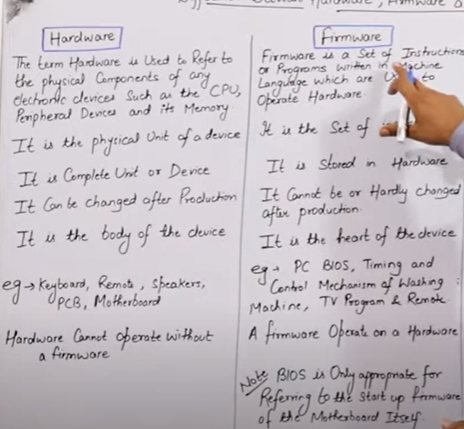
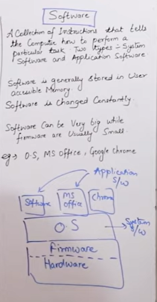

# Lecture NO 1:

# Hardware Software Firmware

- **hardware** is a physical part of a computer
- **software** is a nontoucable part of a computer it is set of instructions given to the computer
- **firmware** is also a software jisko ham hardware k sath hi bnate hein aur ye dosri devices ko hardware k sath attach krta he
  
   