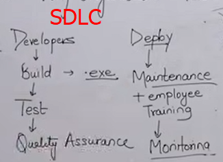
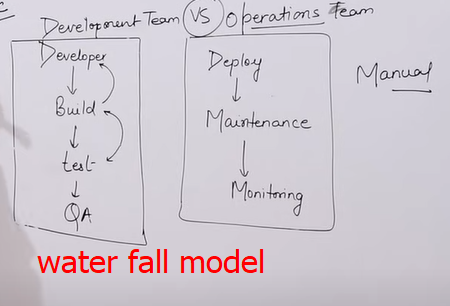
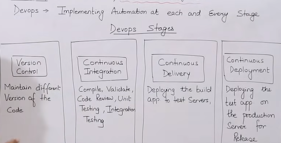
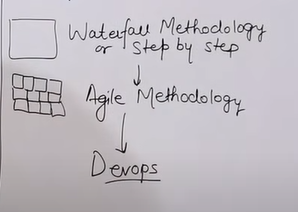
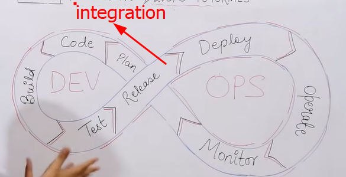
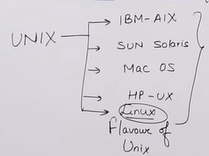
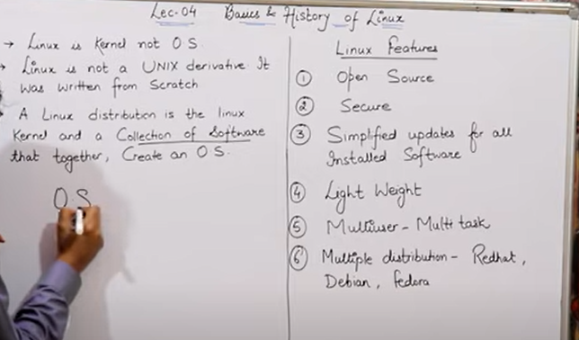
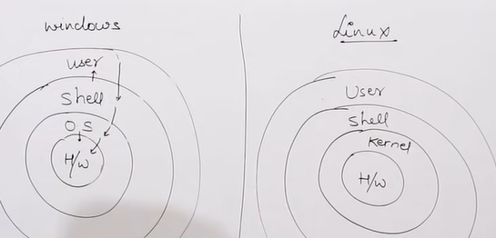
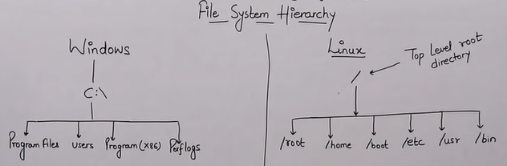
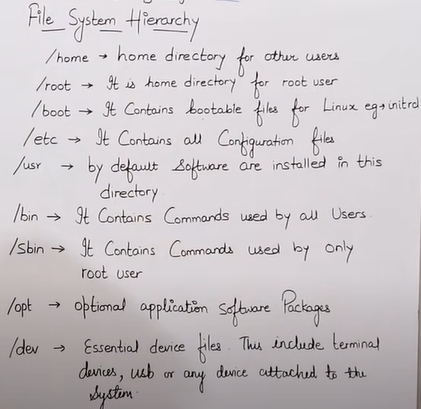

## Myths about  devops:

- programing language not required
- linux experience not required
- prior it experience not required
- non technical person can also learn
## Why company needs DevOps engineer

- fast delivery
- higher quality
- less capex(capital expenditure jo paisa kam se phle lgta he) and opex(oprational expenditure jo kaam k doraan lgta he)
- reduced outages
 
  **jahan pr client betha hota he us jgha ko onsite khte hein aur jahan working team bethi hooti he use ofshore khte hein**
  

- **github** ka kam he k code ko hmre tak devolper se lata he aur hamein code k baare mein btata he
- **maven** ko ham build krne k lye istml krte hein
- **jenkins** code ko aik stage se dosri stage tak le kr jata he
- **docker** deploy mein use hota he
- **cloudwatch** monitring mein use hota he
  
 # Lecture no 2:
- phle dino mein devolepment or operations wali team k darmyan larayi rhti thi to is mamle ko hal krne k lyae Devops kaammein aya aur dosra ye tariqa manual tha hamein aise taiqe ki zarorat thi k kam hoote saath hi khud hi agle stup pr phnch jaye
- **waterfall model** yani aik kaam k baad hi dosra kaam ho ga

- tamam companeis mein aik rozana sycup meeting arrange ki jati he jis mein devolepment aur operations k tamam loog shamil hoote hein wahan un se ip manager un k kaam k baare mein pochta he
  ### DevOps Stages:

  

- version control mein ham software ka version control krte hein aur yahan pr **git** use hoota he
- continues integration code ko review krta he yani agr koi ghlti dekhta he to ise vesion control ko wapis bhj deta he yahan pr **jenkins** use hota he
- continues delivery mein ham code ko excuteable file bnate hein aur ise test krte hein yahan ham **maven** ko use krte hein
  ### DevOPs :
  
   DevOps is a improvment of agile methodlogy
- waterfall model mein ham step atep by step kaam krte hein 
- agile methodology mein ham chote chote pieces mein kaam krte hein ye sirf devlopment level pr hi kaam krti he
- **sprint** are the stages of work in agile
- **scrum** in tamam work ki stages yani sprints ko mushtarka tour pr boolte hein
  
  **final pic**

  # Lecture No 3 :

  ### AWS Cloud :
  **cloud aik service he jo aap ko resources deti he aap unhein use krte hein aur apni usage ki hissab se pay krte hein**
- ksi bhi company ko mukhtalif trh ki applicatins ya softawre bnane k lye servers ki zarorat hooti he
- **server** ese computer ko khte hein jo hamein mukhtalif trh ki services deta he
- aik website bnane k lye hamein mukhtalif trh k kharche krne prte hein maslan server ko kharidna employees ki salary aur bht se kharche aur us k baad bhi apka pakka nhi k website chle ya na in sab kharchon se bachne k lye ham AWS use krte hein
- AWS hamara public cloud service provider he ye hamein tamam server wghera k kharche se bachte hoye hamein tamam services provide krta he
-  agr hamein wse 50 server bnane mein 50 din lgte hein to AWS hamei 5 mnt mein bna kr de de ga
- AWS ki trh aur bhi clouds hein maslan azure gcp aur alibaba
- CLOUD hamein 3 chezein provide krta he 

    - Iaas
    - Paas
    - Saas
- Iaas: ifrasutrecture as a service yaani hamein service k lye jo infrastructure chahye hamein mukhtalif services k lye mukhtalif infrastructure ki zarorat hooti he
  
  **AWS has 76 avalibility zones(az) and 24 regions**
- **Region** pori dunya mein 24 data center bnyae hoye hein k jiss country k jo nazdeek he wo use access kre
- aik region k and 1 se 6 tak AZ ho skte hein ye is lye hoote hein k agr aik zone khrb ho jaay to hamein dosre se services mill sakein
-------------------------------------------------------------------------
# Creating AWS Account:

- search on google 'aws free tier'
- aur phr jo link aaye ga us pr click karein ge
 [link](https://aws.amazon.com/free/?gclid=CjwKCAjwlbu2BhA3EiwA3yXyu81SYLV3T_fLqybCwiq5Z8um9jNLGwHAV5zbQO02EstjorXlthg9QBoCkGUQAvD_BwE&trk=f42fef03-b1e6-4841-b001-c44b4eccaf41&sc_channel=ps&ef_id=CjwKCAjwlbu2BhA3EiwA3yXyu81SYLV3T_fLqybCwiq5Z8um9jNLGwHAV5zbQO02EstjorXlthg9QBoCkGUQAvD_BwE:G:s&s_kwcid=AL!4422!3!637354294245!e!!g!!aws%20free%20tier!19044205571!139090166770&all-free-tier.sort-by=item.additionalFields.SortRank&all-free-tier.sort-order=asc&awsf.Free%20Tier%20Types=*all&awsf.Free%20Tier%20Categories=*all)

 - account bnane k baad ham my acount mein jaate hein aur wahan aws menegment console pr click krte hein
- -------------------------------------------------------------------------

# Lecture No 4:
 
## Linux:
- sab se phle Unix ko denies retichie aur ken thompson ne bnaya tha 
- us k baad bht si companeis ne is k flaouver bnaye
- is k baad 1991 mein linus storvald ne linux ka flevour bnaya
- linux is a kernal is k ssath GNU ko jood dya gya GNU mukhtalif softwares he
- aik operating system mukhtalif kernal aur softwres ko jood kr bnta he
- is trh se ham linux + GNU = operating sytem keh skte hein
 
 
  **linux flevours:**
  
  1- RHEL

  2-Fedora

  3-Debian

  others(ubunto,centos)

  Kali Linux is for Hacking

  **ubuntu** is a third most used operatin system in the world

- operating system 2 trh se use hota he

1- cli 

2- gui

linux ka cli zyada popular aur user friendly  he jabke windows ka gui zyada popular he

**why linux is more secure**

- windows mein agr virus aataa he to wo saare operating system mein phelta chle jata he
- lekin agr linux mein agr virus ksi folder ya file mein ata he to wo sirf us file mein hi rhta he phelta nhi he
- windows agr virus ko khtm krna he to window dobara krni prti he
- linux mein sirf ham virus waali file ko dell krte hein
- linux mein command zyada hein agr hamein ise secure krne k lye 100 command likhni hein tou hacker ko 1000 hack krne k lye likhni padein gi

# Lecture No 5:

**windows case** user interect with shell and OS interact with hardware

**linux case** user interact with shell  and kernal interact with hardware

Difference b/w windows and linux
windows | linux |
---------|-----------
 folder| directory | 
 administrator | root user |
 software| package |

 ##  file system herrarichy:

 

 - windows  ko jab ham install krte hein tou us mei bydefault c dderive bn jaati he is mein sab configration files hooti hein
 - windows mein backslash \ aur linux mein forwrd/ slash hoti he
 - '/' is ko top level root directory khte hein
  
  ## Important Directoreis:

  

  - **/home** home directory for other user root k ilawa jo bhi user hots he wo bydefault is directory mein aakr hi sara kaam krta he
  - **/root** homr directory for root user
  - **/boot** it contains bootable files for linux (POST power on self test) ye sab files ko check krta he k proper chl rhi hein is mein mojood ksi bhi file ko delete krne se system crash ho skta he
  - **/etc** it contain all configration files macheines ki hardware k bare mein all information is mein mojood hooti he
  - **/usr** by default software are install in this directory
  - **/bin** it contains command used by user
  - **/sbin** it contains command used by root
  - **/opt** optional applocation software package 
  - **/dev** essential device files this include terminal devices,usb etc

  

